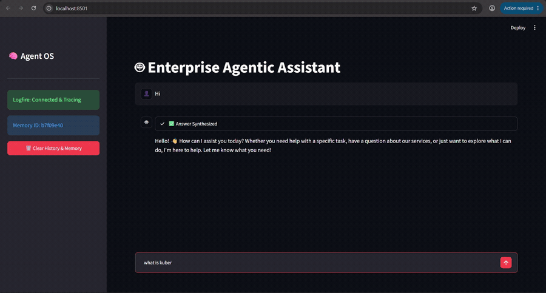

# Enterprise Agentic RAG

A production-style Retrieval-Augmented Generation system that combines a **LangGraph agentic pipeline**, an **LLM gateway with fallback and caching**, **NeMo Guardrails**, and a **hybrid retrieval stack** (vector search + cross-encoder reranking) behind a FastAPI service — with full observability and a RAGAS/DeepEval-based evaluation suite.

Built to explore how the pieces of a real enterprise RAG deployment (routing, safety, resilience, and evaluation) fit together, not just how to answer a question from a document.

## Demo



*A live query hitting the guardrails gate, then flowing through the planner → retriever → responder graph, with a formatted answer synthesized from indexed documentation.*

📹 Full walkthroughs: [App demo (video)](#) · [Evaluation pipeline demo (video)](#)

## Highlights

- **Agentic orchestration with LangGraph** — a stateful `planner → retriever → responder` graph that decides per-turn whether a query needs fresh document retrieval or can be answered conversationally from memory, with thread-based conversation memory via `MemorySaver`.
- **Safety gate with NeMo Guardrails** — a dedicated lightweight LLM (`gpt-oss-20b`) screens every incoming message for off-topic requests and jailbreak attempts *before* it reaches the main pipeline, using Colang-defined flows.
- **LLM gateway (Portkey)** — production model calls are routed through Portkey rather than hitting Groq directly, giving automatic fallback to a smaller model on failure, retry-on-rate-limit, and response caching, with cache-hit status surfaced back to the UI.
- **Hybrid retrieval** — Qdrant vector search (top-15 candidates) followed by a local FlashRank cross-encoder reranker (ONNX, no external API) narrows results to the 5 most relevant chunks per query.
- **Resilient embeddings** — Gemini embeddings (`gemini-embedding-2-preview`, 3072-dim) with automatic fallback to a local `sentence-transformers` model if the Gemini API is unreachable.
- **Multi-format ingestion** — a single pipeline parses PDF, HTML, TXT, DOCX, and PPTX sources (pypdf + pdfplumber fallback, BeautifulSoup, Unstructured), chunks them, and indexes them into Qdrant.
- **Full observability** — every stage (guardrails check, planning, retrieval, reranking, generation) is traced with Pydantic Logfire spans; LangSmith and Langfuse integrations are wired in for LLM-level tracing.
- **Evaluation harness** — a RAGAS/DeepEval-based test suite scores the pipeline on faithfulness, relevancy, and recall against a golden dataset, deliberately mixed with ~100 unrelated "noise" documents to stress-test retrieval precision.

## Architecture

```
User Query
   │
   ▼
[NeMo Guardrails Gate] ──(blocked)──► canned safety response
   │ (clean)
   ▼
┌─────────────────────────── LangGraph Agent ───────────────────────────┐
│                                                                        │
│   [Planner]  ──CONVERSATIONAL──►  [Responder] ──► Final Answer        │
│      │                                 ▲                              │
│   (needs retrieval)                    │                              │
│      ▼                                 │                              │
│   [Retriever]                          │                              │
│    Qdrant search (top 15)              │                              │
│      ▼                                 │                              │
│    FlashRank rerank (top 5) ───────────┘                              │
│                                                                        │
└────────────────────────────────────────────────────────────────────────┘
      │
      ▼
Portkey Gateway (Groq gpt-oss-120b → fallback llama-3.1-8b-instant, cached)
```

## Tech Stack

| Layer | Technology |
|---|---|
| API | FastAPI, Uvicorn |
| Agent orchestration | LangGraph, LangChain |
| LLM inference | Groq (`gpt-oss-120b` / `gpt-oss-20b`), routed via Portkey |
| Guardrails | NVIDIA NeMo Guardrails (Colang) |
| Vector database | Qdrant |
| Embeddings | Google Gemini (`gemini-embedding-2-preview`), `sentence-transformers` fallback |
| Reranking | FlashRank (local ONNX cross-encoder) |
| Document parsing | pypdf, pdfplumber, BeautifulSoup4, Unstructured, python-docx, python-pptx |
| Observability | Pydantic Logfire, LangSmith, Langfuse |
| Evaluation | RAGAS, DeepEval |
| Frontend | Streamlit |

## Project Structure

```
app/
├── main.py                    # FastAPI entrypoint — guardrails gate + agent invocation
├── config.py                  # Centralised settings from environment variables
├── agents/
│   ├── graph.py                # LangGraph state machine definition
│   ├── state.py                 # Shared agent state schema
│   └── nodes/
│       ├── planner.py            # Routes between conversational memory and retrieval
│       ├── retriever.py          # Vector search + reranking
│       └── responder.py          # Final answer synthesis via Portkey
├── guardrails/
│   ├── rails.py                 # NeMo Guardrails initialisation and gate logic
│   └── colang_rules.py           # Off-topic / jailbreak / dialog flow definitions
├── gateway/
│   └── client.py                 # Portkey-backed LLM client (fallback + caching)
├── services/retrieval/
│   ├── embedding.py               # Gemini embeddings with local fallback
│   ├── qdrant_service.py          # Vector search
│   └── ranking_service.py         # FlashRank cross-encoder reranking
└── ingestion/
    ├── processor.py               # Parse → chunk → embed → index pipeline
    ├── chunking/splitter.py        # Paragraph-based text chunking
    └── loaders/                    # Format-specific parsers (PDF, HTML, TXT, Office)

evals/                          # RAGAS/DeepEval evaluation pipeline and golden dataset
notebooks/                      # Exploratory notebooks for guardrails, gateway, evals
ui/                              # Streamlit chat interface
DATA/
├── true_data/                    # Relevant source documents (Kubernetes, monitoring, autoscaling)
└── noisy_data/                   # Unrelated documents used to stress-test retrieval precision
```

## Getting Started

### Prerequisites
- Python 3.11+
- API keys for: Groq, Google Gemini, Qdrant Cloud, Portkey, Pydantic Logfire (and optionally LangSmith / Langfuse)

### Installation

```bash
git clone <your-repo-url>
cd RAG
pip install -r requirements.txt
```

Create a `.env` file in the project root with:

```
GROQ_API_KEY=
GEMINI_API_KEY=
QDRANT_CLUSTER_ENDPOINT=
QDRANT_API_KEY=
PORTKEY_API_KEY=
PORTKEY_CONFIG_SLUG=
LOGFIRE_TOKEN=
LANGSMITH_API_KEY=
```

### Ingest documents

```bash
python -m app.ingestion.processor DATA --wipe
```

### Run the API

```bash
uvicorn app.main:app --reload --port 8000
```

Query it:

```bash
curl -X POST http://localhost:8000/query \
  -H "Content-Type: application/json" \
  -d '{"q": "How do I autoscale a Kubernetes pod?"}'
```

### Run the Streamlit UI

```bash
streamlit run ui/app.py
```

### Run evaluations

```bash
python -m evals.pipeline
```

## Design Decisions Worth Noting

- **Two-tier LLM strategy**: a fast, cheap model gates every request for safety before a stronger model is ever invoked for retrieval or generation, keeping cost and latency down on the majority of benign traffic.
- **Gateway-mediated inference**: routing production calls through Portkey rather than calling Groq directly decouples the app from any single provider outage and adds semantic caching without changing application code.
- **Local reranking**: FlashRank runs as a quantized ONNX model with no external API call, so reranking adds negligible latency and no extra cost per query.
- **Deliberately noisy test corpus**: the ingestion set intentionally mixes a small number of relevant documents with a large volume of unrelated technical papers, to validate that retrieval and reranking surface the correct context rather than just "something plausible."

## License

See [LICENSE](LICENSE).
